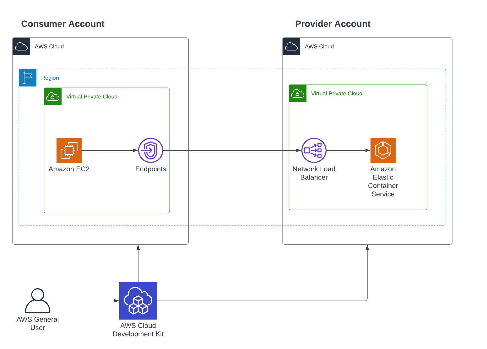
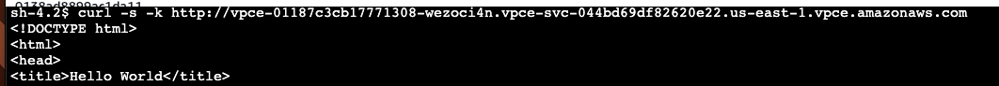

# CDK Sample: Private cross-account APIs with AWS PrivateLink & VPC Endpoints

This example contains 2 CDK project 1 provider project & 1 consumer project. The provider creates an ECS Cluster with a private VPC Endpoint for a secure, protected API. The example is based on [apigateway-vpcendpoints](https://github.com/aws-samples/apigateway-vpcendpoints). The Consumer Project creates a ec2 in a VPC with a Interface endpoint pointing to the private VPC Endpoint from the provider. 
Additional example [cross-account VPC access in AWS]( https://tomgregory.com/cross-account-vpc-access-in-aws/)

To simulate a real-world do you need two AWS Accounts 1 for the consumer 1 for the producer. The best way to set this up is to use the AWS CLI and profiles. You can configure, e.g. the consumer credentials with `aws configure --profile consumer`.  The provider credentials are configured in the `aws configure --profile provider`.




## Get started 

1. Setup project and CDK

clone the repository 
```bash
git clone https://github.com/philschmid/cdk-samples.git
cd aws-ecs-examples/ecs-private-endpoint-nlb
```

Install the cdk required dependencies. Make your you have the [cdk](https://docs.aws.amazon.com/cdk/latest/guide/getting_started.html#getting_started_install) installed.
```bash
pip3 install -r requirements.txt
```

[Bootstrap](https://docs.aws.amazon.com/cdk/latest/guide/bootstrapping.html) your application in the cloud.

```bash
cdk bootstrap
```

2. Deploy provider stack

We will use the `AWS_PROFILE` variable to select our provider profile. Additionally we need to provide a context variable for our consumer account. This context variable is the `consumer-aws-account-id` and is used to authenticate the consumer with the provider.

```bash
cd provider-stack
AWS_PROFILE=provider cdk deploy -c consumer-aws-account-id={CONSUMER_ACCOUNT_ID}
```

After the deployment you should see the following output:
```bash
Outputs:
ClusterWithVpcAndNlbStack.ServiceLoadBalancerDNSEC5B149E = Clust-Servi-5OIW2PSCJ9YB-e8fc8f2ae82e8ad8.elb.us-east-1.amazonaws.com
ClusterWithVpcAndNlbStack.VpcEndpointServiceId = vpce-svc-044bd69df82620e22
ClusterWithVpcAndNlbStack.VpcEndpointServiceName = com.amazonaws.vpce.us-east-1.vpce-svc-044bd69df82620e22
```

Copy the `VpcEndpointServiceName` we ll need it for the consumer deployment to create the interface endpoint

3. Deploy consumer stack

We will use the `AWS_PROFILE` variable to select our consumer profile. Additionally we need to provide a context variable for our consumer account. This context variable is the `vpc-endpoint-service-name` and is used to create the interface endpoint in  the consumer to access the provider.

```bash
cd consumer-stack
AWS_PROFILE=consumer cdk deploy -c vpc-endpoint-service-name={VpcEndpointServiceName}
```

InferfaceEndpointDns

After the deployment you should see the following output:
```bash
Outputs:
Ec2WithVpc.InferfaceEndpointDns = Z7HUB22UULQXV:vpce-01187c3cb17771308-wezoci4n.vpce-svc-044bd69df82620e22.us-east-1.vpce.amazonaws.com
```

Remove the `Z7HUB22UULQXV:**` from the output and use it as the DNS name for the consumer ec2.


4. Test endpoint
  
Go to the consumer ec2 console and login into the instance using SSM Agent. After that you should be able to run the following curl command
```bash
curl -s -k http://vpce-01187c3cb17771308-wezoci4n.vpce-svc-044bd69df82620e22.us-east-1.vpce.amazonaws.com
```



5. Clean up 

delete provider stack

```bash
cd provider-stack
AWS_PROFILE=provider cdk deploy -c consumer-aws-account-id={CONSUMER_ACCOUNT_ID}

```

delete consumer stack

```bash
cd consumer-stack
AWS_PROFILE=consumer cdk destroy -c vpc-endpoint-service-name={VpcEndpointServiceName}
```