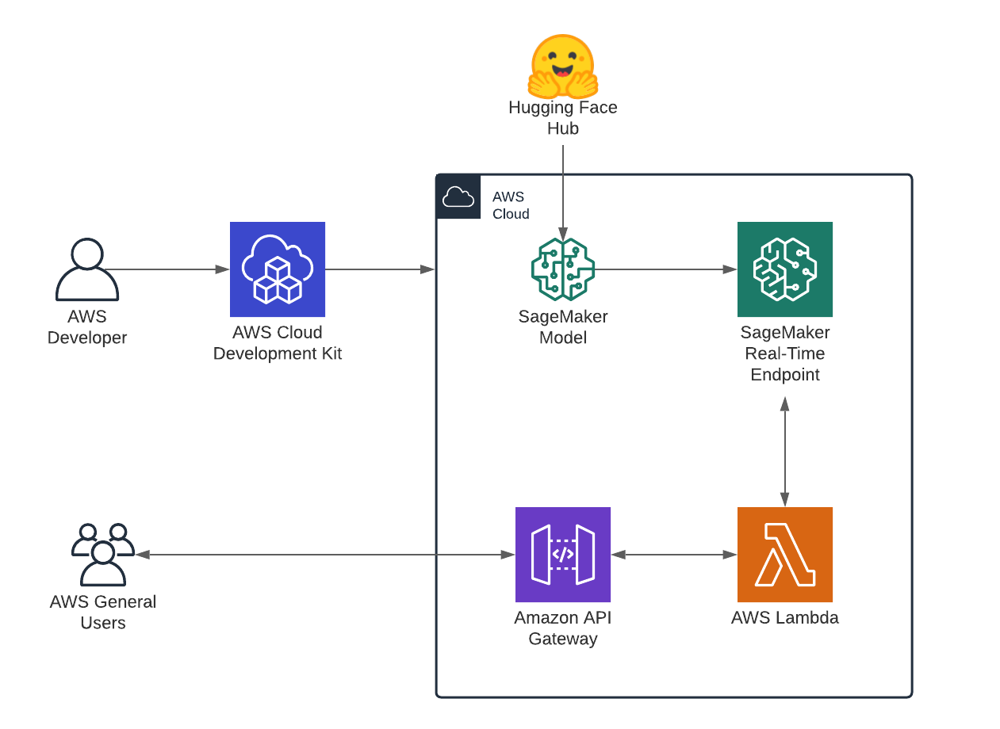

# CDK Sample: Deploy a Hugging Face Transformer model to Amazon Sagemaker

This example creates an SageMaker real-time Endpoint using the Hugging Face DLC. You can provide your `model` and `task` for the model you want to deploy from huggingface.co/models as input `parameters`. The Stack will create an IAM Role with the required permissions to execute your endpoint, a SageMaker Model, a SageMaker Endpoint Configuration and the Endpoint itself. 



## Get started 

clone the repository 
```bash
git clone https://github.com/philschmid/cdk-samples.git
cd aws-lambda-sagemaker-endpoint-huggingface
```

Install the cdk required dependencies. Make your you have the [cdk](https://docs.aws.amazon.com/cdk/latest/guide/getting_started.html#getting_started_install) installed.
```bash
pip3 install -r requirements.txt
```

[Bootstrap](https://docs.aws.amazon.com/cdk/latest/guide/bootstrapping.html) your application in the cloud.

```bash
cdk bootstrap
```

Deploy your Hugging Face Transformer model to Amazon SageMaker

```bash
cdk deploy \
  -c model="distilbert-base-uncased-finetuned-sst-2-english" \
  -c task="text-classification"
```

clean up

```bash
cdk destroy \
  -c model="distilbert-base-uncased-finetuned-sst-2-english" \
  -c task="text-classification"
```


## Context

* `model` (required): Defines the Hugging Face Model from hf.co/models you want to use, e.g. `-c model=distilbert-base-uncased-finetuned-sst-2-english`

* `task` (required): Defines the [Hugging Face Task for a pipeline](https://huggingface.co/transformers/main_classes/pipelines.html), e.g. `-c task=ext-classification`

* `instance_type` (default `ml.m5.xlarge`): Defines the ec2 instance type you want to use for your endpoint, e.g. `-c instance_type=ml.g4dn.xlarge`

* `role`: Defines wether the `cdk` should create a new execution role for SageMaker to be used with your endpoint. if context for role is defined SageMaker tries to use it, e.g. `-c role=arn:aws:iam::123456789012:role/my_sagemaker_role`

## Extras

To customize it you can adjust the `config.py` or fork it. There is also an additional Parameter. `instance_type` you can define when running `cdk deploy` if you want to host on a specifc machine. 


