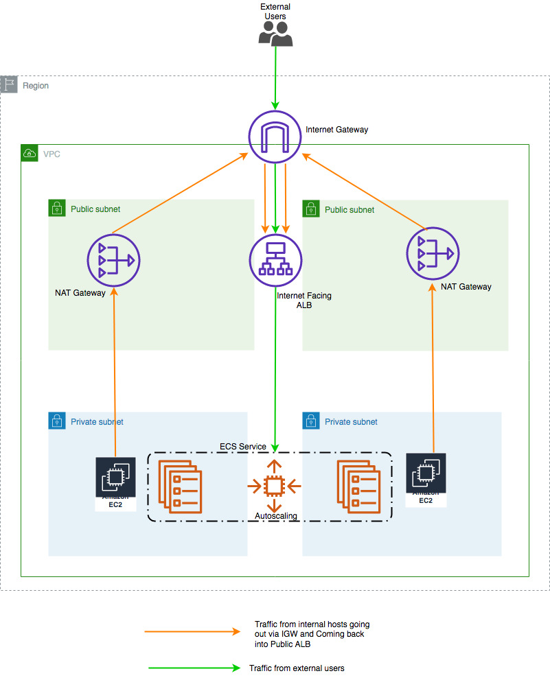

# CDK Sample: Deploy a ECS Cluster and run a Webservice API with Autoscaling

This example creates an ECS Cluster including a VPC, Auto-Scaling Group for the ECS Cluster, ALB for our Webservice. It includes a `Construct` in [ecs_service](./infrastructure/ecs_service.py) `WebService`, which creates a Service with Task including optional autoscaling for this Task.



## Get started 

clone the repository 
```bash
git clone https://github.com/philschmid/cdk-samples.git
cd ecs-cluster-ec2
```

Install the cdk required dependencies. Make your you have the [cdk](https://docs.aws.amazon.com/cdk/latest/guide/getting_started.html#getting_started_install) installed.
```bash
pip3 install -r requirements.txt
```

[Bootstrap](https://docs.aws.amazon.com/cdk/latest/guide/bootstrapping.html) your application in the cloud.

```bash
cdk bootstrap
```

Deploy your Hugging Face Transformer model to Amazon SageMaker. Before you can deploy adjust the `Webservice` creation in [cluster](./infrastructure/ecs_cluster.py).

```bash
cdk deploy 
```


