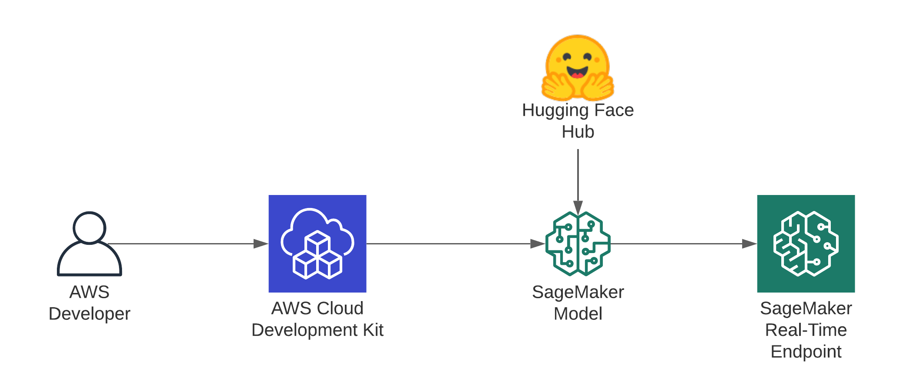

# CDK Sample: Deploy a Hugging Face Transformer model to Amazon Sagemaker

This example creates an SageMaker real-time Endpoint using the Hugging Face DLC. You can provide your `model` and `task` for the model you want to deploy from huggingface.co/models as input `parameters`. The Stack will create an IAM Role with the required permissions to execute your endpoint, a SageMaker Model, a SageMaker Endpoint Configuration and the Endpoint itself. 



## Get started 

clone the repository 
```bash
git clone https://github.com/philschmid/sample-huggingface-sagemaker-cdk.git
```

Install the cdk required dependencies. Make your you have the [cdk](https://docs.aws.amazon.com/cdk/latest/guide/getting_started.html#getting_started_install) installed.
```bash
pip3 install -r requirements.txt
```

[Bootstrap](https://docs.aws.amazon.com/cdk/latest/guide/bootstrapping.html) your application in the cloud.

```bash
cdk bootstrap
```

Deploy your Hugging Face Transformer model to Amazon SageMaker

```bash
cdk deploy \
  --parameters model="distilbert-base-uncased-finetuned-sst-2-english" \
  --parameters task="text-classification"
```

## Extras

To customize it you can adjust the `config.py` or fork it. There is also an additional Parameter. `instance_type` you can define when running `cdk deploy` if you want to host on a specifc machine. 
